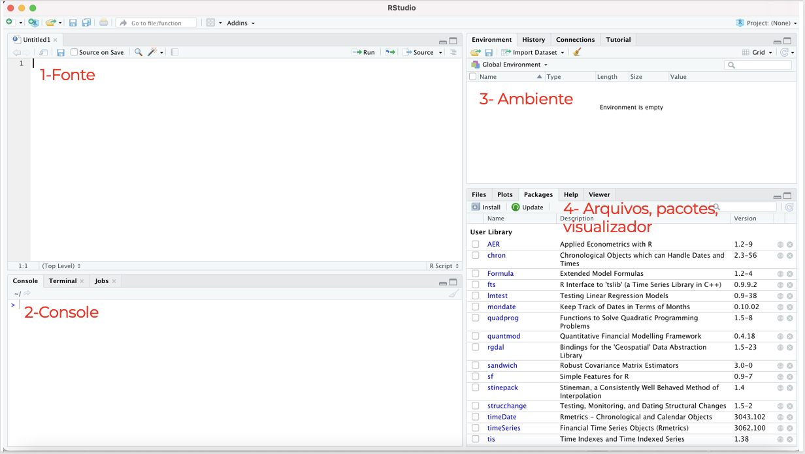
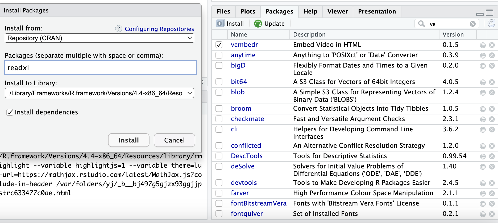
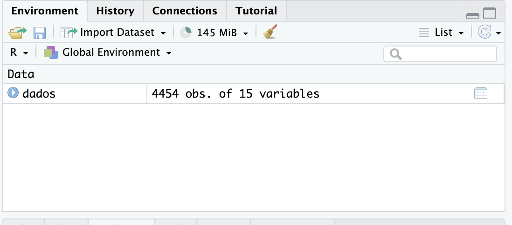
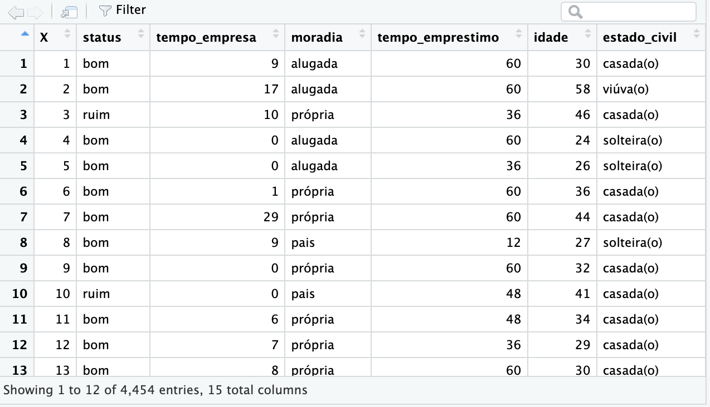

--- 
title: "Introdução ao R"
author: "Eugênia Cerqueira"
output:
  bookdown::bookdown_site:
    split_by: section
link-citations: yes
output_dir: _site
---

# Introdução

Bem-vindos ao Curso de Introdução ao R do MQ da FAFICH-UFMG!

O curso possui como objetivo apresentar os elementos básicos dos softwares R e RStudio. Durante as aulas, vocês serão introduzidos à linguagem R, aprenderão a realizar operações básicas, criar objetos, importar e exportar dados, manipular dados e criar visualizações impactantes.

O curso será ministrado em 5 aulas de 3 horas cada, onde apresentaremos conceitos fundamentais, exemplos práticos e exercícios de fixação para garantir o aprendizado efetivo.

Nosso foco será no aprendizado dos princípios básicos do R, com ênfase na realização de análises estatísticas descritivas e exploratórias. Ao longo do curso, vocês aprenderão a:

Manipular variáveis e bancos de dados (criar, recodificar, transformar e fundir);
Aplicar medidas-resumo;
Elaborar a apresentação dos resultados através de tabelas, gráficos e modelos.


## Para que usar o R?

O R é um programa gratuito e de código aberto

Ao contrário de muitos softwares de análise de dados, o R é gratuito.

Além disso, o R é open source. Ou seja, o código de programação dele fica aberto ao público e todos os interessados podem propor modificações. 

O RStudio é um ambiente integrado de código aberto para escrever scripts no R e utilizar outros recursos baseados no R.

O R te abre portas

Há linguagens de programação de vários níveis, que conversam com o computador em diferentes camadas de complexidade.

A familiaridade com a linguagem R permite a compreensão mais rápida de outras como Python, MatLab etc. 


Vale lembrar:

O R se

## Instalação

O RStudio é um ambiente integrado de código aberto para escrever scripts no R e utilizar outros recursos baseados no R.

Há diversas versões do RStudio. Baixe a versão gratuita e, em seguida, o instalador para o seu sistema operacional.

# Aula 1

Na primeira aula veremos como carregar e exportar dados no R, os principais tipos de dados.

## Interface

O RStudio é um editor de texto especial que foi personalizado para facilitar o trabalho com R. Ele pode ser instalado no seu próprio computador ou você pode fazer login em um servidor RStudio compartilhado (por exemplo, um administrado pela sua universidade) a partir de um navegador web. De qualquer forma, a interface é basicamente a mesma e contém 4 painéis principais:
<br>
<br>
```{r figureinterface, echo=FALSE, fig.cap="", out.width = '90%'}

```
<br>
<br>
1-Fonte: Onde se escreve o código. No editor de código, você poderá escrever e editar os scripts. Script nada mais é do que uma sequência de comandos/ordens que serão executados em sequência pelo R
<br>
<br>
2-Console: Onde o código da fonte é avaliado pelo R. Pode-se também utilizar o console para realizar códigos rápidos, sem salvá-los.
<br>
<br>
3-Ambiente: Exibe os objetos e dados de trabalho.
<br>
<br>
4- Abas plots, packages
<br>
<br>
A aba Plots trará os gráficos gerados, possibilitando a exportação para alguns formatos diferentes, como .png e .pdf. 
Na aba Files, você terá uma navegação de arquivos do seu comdrputa
Em Packages estão listados os pacotes instalados. Você pode verificar quais estão carregados e, caso necessário, poderá carregar algum pacote necessário para a sua análise. Também é possível instalar e atualizar pacotes. 


## Instalando pacotes

Pacotes no R são coleções de funções, dados e documentação desenvolvidas para ampliar as funcionalidades básicas do R. Pense nos pacotes como "plugins" ou "extensões" que você pode adicionar ao R para realizar tarefas específicas que não estão incluídas na instalação padrão do software.
<br>
<br>
Um pacote pode incluir:
<br>
Funções: Conjuntos de comandos que automatizam tarefas específicas.
Dados: Conjuntos de dados que podem ser usados para prática e exemplos.
Documentação: Instruções e exemplos que explicam como usar as funções do pacote

<br>
Pacotes podem ser através do comando install.packages (“nomedopacote”) 
<br>
```{r, eval=FALSE}
instal.packages("readxl")
```

Lembrete: o nome do pacote sempre deve estar entre aspas.
<br>
<br>
Pacotes também podem ser instalados na aba "Packages" e em "Install".
<br>
<br>
Uma nova janela abrirá, na qual podemos procurar o pacote desejado e instalá-lo.
<br>
<br>
```{r figure2, echo=FALSE, fig.cap="", out.width = '90%'}

```
<br>
<br>
Para a aula de hoje vamos instalar os seguintes pacotes:
<br>
<br>
```{r, eval=FALSE}
instal.packages("readxl")
instal.packages("readr")
```


## Carregando pacotes

Para utilizar os pacotes instalados é necessário carregá-los antes através da função library(nomedopacote). Atenção: o nome do pacote não deve vir entre aspas, como na função de instalar.

Caso tente executar uma função de um pacote que não esteja carregado, o R responderá com uma mensagem de erro.


```{r}
library(readxl)
```

## Carregar arquivos


### Arquivos CSV

CSV significa comma separated values (valores separados por vírgulas) e consiste em um formato muito comum para dados que podem ser utilizados entre diferentes programas de software. Um arquivo CSV é um arquivo de texto simples que contém uma lista de dados, com cada valor separado por vírgula. 

O R é capaz de ler um arquivo CSV sem carregar nenhum pacote. Podemos usar o comando read.csv() para carregar um arquivo.

```{r}
dados<-read.csv("/Users/eugeniaviana/Documents/Documents/Eugenia/Sociologia/MQ/aula1.csv")
```

O diretório do arquivo deve vir entre aspas.

A função sep= permite escolher o separador do arquivo csv.

```{r}
dados<-read.csv("/Users/eugeniaviana/Documents/Documents/Eugenia/Sociologia/MQ/aula1.csv", sep=",")
```

### Arquivos Excel

O R também pode ler arquivos Excel, embora não seja uma função integrada à versão base do software. Para isso, é necessário instalar e carregar o pacote readxl.

*Atenção,caso o arquivo Excel tenha mais de uma aba, é necessário especificar qual aba deverá ser lida.

```{r}
library(readxl)
```

### Arquivos DTA, SPSS, Dat

Para ler os arquivos SPSS é necessário instalar e carregar o pacote foreign.
Já os arquivos DTA são carregados através do pacote haven.

```{r}
library(foreign)
library(haven)
```

## Tipos de arquivos no R

### Dataframe

DataFrame é uma estrutura de dados que organiza os dados em uma tabela bidimensional de linhas e colunas, como uma planilha. Os DataFrames são uma das estruturas de dados mais comuns na análise de dados moderna, pois são uma maneira flexível e intuitiva de armazenar e trabalhar com dados.

Uma vez o arquivo carregado, ele deve aparecer no painel "Environment", no canto superior direito. O ícone de tabela no canto direito indica que se trata de um dataframe. 

```{r dataframe, echo=FALSE, fig.cap="", out.width = '90%'}

```

Para visualizá-lo, basta clicar no ícone. O dataframe indica as variáveis, o número de de linhas e colunas.

```{r dataframe2, echo=FALSE, fig.cap="", out.width = '90%'}

```

## Tipos de variáveis

Existem diversos tipos de objetos, e cada tipo “armazena” um conteúdo diferente, desde tabelas de dados recém-carregados a textos, números, ou simplesmente a afirmação de verdadeiro ou falso (Boleano).

Repare nas atribuições acima. Usaremos a função class() para ver o tipo de cada uma:

## Exportar arquivos

### Objetos RDS

Objetos rds são arquivos próprios do R e servem para salvar em arquivo local qualquer tipo de estrutura de dados, mantendo sempre todas as propriedades do objeto original. Arquivos rds podem ser salvos com a função write_rds(), do pacote readr.

# Aula 2

## Resumo de variáveis

O comando summary(dataframe) permite resumir os dados, apontando média, mediana, máximo, mínimo e quartis. 

```{r}
summary(dados)
```


Para encontrar o desvio padrão é necessário usar o comando sd (). Porém, atenção! Nesse comando é necessário especificar a coluna para a qual queremos aferir o desvio padrão.

O mesmo pode ser aplicado às formulas mean(), max(), min(), quantile()

### Variáveis quantitativas

```{r}
sd(dados$idade)
mean(dados$idade)
max(dados$idade)
min(dados$idade)
quantile(dados$idade)
```

### Variáveis qualitativas

Para verificar as categorias em variáveis qualitativas utilizamos a função unique:

```{r}
unique(dados$moradia)
```

## Trabalhando com NAs

A função is.na() realiza um teste para saber se a variável/coluna possui um valor NA. retorna TRUE se for NA e FALSE se não for. 

```{r}
is.na(dados$moradia)
```

Algumas funções possuem o argumento na.rm, ou semelhantes, para desconsiderar NA no cálculo. É o caso da função mean() ou sum().

```{r}
mean(dados$renda, na.rm=T)
```

## Tabelas

### Função table
Para criar tabelas o R possui a função table, incorporado ao seu próprio sistema.

Por exemplo, vamos começar criando uma tabela que mostre a divisão da variável
Moradia, por categoria.
```{r}
table(dados$moradia)
```

Podemos também criar uma tabela de contingência, cruzando duas variáveis qualitativas
```{r}
table(dados$moradia, dados$status)
```

### Pacote pollster

O pacote pollster permite a realização de tabelas ponderadas. É muito útil para se trabalhar com dados de pesquisas como censo etc. 

Como exemplo, usaremos dados da pesquisa de origem e destino de Belo Horizonte (Fundação João Pinheiro, 2012).

Os resultados da tabela mostram a frequência de observações ponderadas pelo fator, o percentual de cada categoria e o percentual acumulado.

```{r}
library(readxl)
idosos<-read_excel("/Users/eugeniaviana/Documents/Documents/Eugenia/Sociologia/MQ/Idosos.xlsx")
```

A função topline permite criar uma tabela ponderada a partir de uma variável. No comando weight = indicamos a variável correspondente ao fator de ponderação.
```{r}
library(pollster)
topline(df = idosos, variable = UDM, weight = Fator)
```

Já função crosstab permite criar uma tabela de contingência ponderada, a partir de duas variáveis.

```{r}
crosstab(df = idosos, x = UDM, y = Sexo, weight = Fator)
```

### Pacote dplyr
```{r}
library(dplyr)
```

```{r}

```
### Pacote GT

O pacote gt é um pacote relativamente novo que permite a apresentação de tabelas de maneira limpa e organizada

```{r}
library(gt)
library(gtsummary)
```

Tabela de resumo
```{r}
dados %>% 
  select(moradia,status,idade) %>% 
  tbl_summary()
```


```{r}
dados %>% 
  select(moradia,renda) %>% 
  tbl_summary(by=moradia,
              statistic=all_continuous() ~ c("{mean}"))
```

# Aula 3

No dia a dia de quem trabalha com dados, infelizmente, é muito comum se deparar com dados formatados de um jeito bastante complicado de se manipular. Isso acontece pois a forma de se trabalhar com dados é muito diferente da forma de se apresentar ou visualizar dados. Resumindo: ler dados requer uma estrutura bem diferente de manipular dados. Limpeza de dados também é considerada parte da manipulação de dados.


## Criando variáveis

Esta seção se concentra na criação de novas variáveis para sua análise como parte de uma estratégia geral de limpeza de seus dados. Muitas vezes, os dados chegarão a nós codificados de uma certa maneira, mas podemos desejar transformá-los para torná-los mais fáceis de se trabalhar. 

Nossas análises frequentemente se concentram em mudanças lineares em uma variável dada, mas os dados geralmente não são codificados de forma a representar esses tipos de diferenças. 

### Criando uma variável

### Usando o comando ifelse

O comando ifelse é lido como uma frase. 

```{r figurename, echo=FALSE, fig.cap="", out.width = '90%'}
knitr::include_graphics("/Users/eugeniaviana/Documents/Documents/Eugenia/Sociologia/MQ/ifelse.png")
```

Digamos que queremos criar uma nova variável que nos indique se determinado indivíduo na nossa base de dados é um trabalhador autônomo ou não.

```{r}
dados$autonomo<-ifelse(dados$trabalho=="autônomo","sim","não")
head(dados$autonomo)
```

*Maior e menor que*

Vamos utilizar a variável idade para mostrar a utilidade dos operadores matemáticos "maior que" e "menor que". Digamos que queremos criar uma nova variável qualitativa que mostre quem são os idosos na nossa base de dados.

Pedimos ao R para selecionar todas observações igual ou maiores que 60 da variável idosos. Se essa condição for preenchida, queremos que na nova variável tenhamos uma categoria "Idosos". 

```{r}
dados$idadeQ<-ifelse(dados$idade>=60,"Idosos","Não Idosos")
```

Após realizar o comando podemos abrir o dataframe para verificar se a nova coluna foi corretamente criada.

```{r}
head(dados$idadeQ)
```


```{r}
my_tbl <- tibble::tribble(
  ~Col_1, ~Col_2, 
      NA,     NA,     
      NA,     NA,     
      NA,     NA,     
      NA,     NA,     
  )

require(knitr)
kable(my_tbl, digits = 3, row.names = FALSE, align = "c",
              caption = NULL)

```


Vamos complexificar um pouco mais. Digamos que agora nós queremos 3 categorias.
Todos indivíduos com menos 40 anos serão classificados como jovem adultos. De 40 a 59 anos, como adultos e mais de 60 anos, como idosos.

O operador & é utilizado para indicar que temos que obedecer mais de uma condição ao mesmo tempo.

```{r}
dados$idadeQ<-ifelse(dados$idade<40,"Jovem adultos",ifelse(dados$idade>=40 & dados$idade<60, "Adultos","Idosos"))

```

## Filtrar

A filtragem de variáveis pode ser feita através do comando subset.

Repare que o novo dataframe dadosf contém 4314 observações, pois abarca apenas os indivíduos mais jovens que 60 anos.

```{r}
dadosf<-subset(dados, idade < 60)
summary(dadosf)
```

O comando subset permite selecionar apenas as colunas desejadas

```{r}
dadosf<-subset(dados, select=c("moradia","status","idade"))
head(dadosf)
```

Digamos que queremos montar uma tabela apenas com indivíduos cuja moradia é própria ou alugada.

```{r}
dadosmoradia<-subset(dados, moradia == "alugada")
summary(dadosmoradia)
```

## Remover dados

Using the select() verb, we can answer interesting questions about our dataset by focusing in on related groups of verbs. The colon (:) is useful for getting many columns at a time.

### Remover dados na


## Renomear variáveis

Às vezes será necessário renomear as variáveis no nosso dataframe.

Carregamos o pacote dplyr

```{r}
library(dplyr)
```

```{r}
dados <- dados %>% rename(teste = estado_civil)
```

```{r}
head(dados)
```


# Aula 4

## Junção de dados

Existem duas grandes formas de junção de dados: UNIÃO e CRUZAMENTO.

Para que uma união seja possível, os dois conjuntos de dados precisam ter os mesmos campos. Para que um cruzamento seja possível, os dois conjuntos precisam ter pelo menos um campo em comum.

### União de dados

#### Juntar linhas
<br>
A união de dados é mais intuitiva. Basta ter a mesma quantidade de campos e que estes estejam “alinhados.” A função mais usada para isso é o famoso bind_rows() (Row Bind). Caso os campos tenham exatamente os mesmos nomes e tipo, o bind_rows() consegue fazer a união perfeitamente.
<br>
Vamos testar com dois dataframes referentes a dados Airbnb em Minas Gerais. Queremos juntar a tabela referente aos dados de Belo Horizonte com a tabela de dados sobre Ouro Preto. Para isso vamos, primeiramente ler os arquivos:
<br>
```{r}
library(dplyr)
```
<br>
```{r}
BHair<-read.csv("/Users/eugeniaviana/Documents/Documents/Eugenia/Sociologia/MQ/Aula 4/BHairbnb.csv")
OPair<-read.csv("/Users/eugeniaviana/Documents/Documents/Eugenia/Sociologia/MQ/Aula 4/OPairbnb.csv")
```
<br>

```{r}
airbnb<-bind_rows(BHair,OPair)
```
<br>
```{r}
summary(airbnb)
```

#### Juntar colunas
<br>
Para ilustrar operações de junção, consideraremos primeiro o tipo mais comum, uma "junção à esquerda"(left_join). No esquema abaixo, os dois data frames compartilham uma coluna comum, V1. Podemos combinar os dois data frames em um único data frame, correspondendo as linhas do primeiro data frame com as do segundo data frame que compartilham o mesmo valor da variável V1.
<br>
<br>
```{r leftjoin, echo=FALSE, fig.cap="", out.width = '90%'}
knitr::include_graphics("/Users/eugeniaviana/Documents/Documents/Eugenia/Sociologia/MQ/leftjoin.png")
```
<br>
Vamos unir os dados de Airbnb sobre BH com uma nova coluna, informando o tipo de locação. Primeiro, vamos carregar o segundo arquivo.
<br>

```{r}
BHair2<-read.csv("/Users/eugeniaviana/Documents/Documents/Eugenia/Sociologia/MQ/Aula 4/BHair.csv")
head(BHair2)
```

Agora vamos unir os dois arquivos

```{r}
left_join(BHair,BHair2, by="url")
```

Another joining operation is the “inner join” in which only observations that are common to both data frames are included.

#### Merge

### Cruzamento de dados

Entenda chave como uma coluna que está presente da mesma forma em dois conjuntos de dados distintos. O conceito completo de chave é bem mais complexo que isto, mas, para começarmos a entender e usar os joins, basta usar essa intuição.

Tendo esse conceito simplificado de chave em mente, a primeira coisa que se deve fazer quando for preciso cruzar dois conjuntos de dados é tentar identificar quais os campos chaves, ou seja, quais campos estão presentes nos dois grupos.

O que acontece quando nem todos os códigos de um grupo estão no outro? E quando um grupo tem códigos repetidos em várias linhas? Para responder a essas e outras perguntas precisamos conhecer os diferentes tipos de joins. Existe pelo menos uma dezena de tipos de joins, mas 90% das vezes você precisará apenas dos tipos básicos que explicaremos a seguir. Usaremos o pacote dplyr para aplicar os joins. O R base possui a função merge() para joins, 

Inner Join (ou apenas Join)

Trata-se do join mais simples, mais básico e mais usado dentre todos os outros tipos. O seu comportamento mantém no resultado apenas as linhas presentes nos dois conjuntos de dados que estão sendo cruzados. O inner join funciona da seguinte forma:

## Remover dados duplicados

Às vezes temos informações duplicadas em nossos bancos de dados e precisamos guardar apenas aqueles que apresentam valores únicos. 

# Aula 5

## Visualização de variáveis

### Pacote ggplot2


O pacote ggplot2 é um poderoso pacote de visualização de variáveis.
Esse pacote é estruturado de forma que a “gramática” seja utilizada para um gráfico a partir de múltiplas camadas. 

As camadas serão formadas por dados, mapeamentos estéticos, transformações estatísticas dos dados, objetos geométricos (pontos, linhas, barras etc.) e ajuste de posicionamento. Além disso, existem outros componentes, como os sistemas de coordenadas (cartesiano, polar, mapa etc.) e, se for o caso, divisões do gráfico em subplots (facet). Um simples exemplo de múltiplas camadas seria um gráfico de pontos adicionado de uma curva de ajustamento.

```{r}
library(ggplot2)
```

```{r}
dados<-read.csv("/Users/eugeniaviana/Documents/Documents/Eugenia/Sociologia/MQ/aula1.csv")
```

#### Diagrama de barras simples

Vamos criar um simples diagrama de barras. 

```{r}
ggplot(dados, aes(x=estado_civil))+geom_bar()
```

O comando fill="cor" pode ser utilizado para escolher a cor do diagrama. Vamos escolher a cor azul claro (lightblue), que já vem como um das cores padrões do R.


```{r}
ggplot(dados, aes(x=estado_civil))+geom_bar(fill="lightblue")
```

Além disso podemos escolher uma cor personalizada, através do código hex. 

```{r}
ggplot(dados, aes(x=estado_civil))+geom_bar(fill="#5EB8B4")
```

#### Adicionando títulos

```{r}
ggplot(dados, aes(x=estado_civil))+geom_bar(fill="#5EB8B4")+
  xlab("Estado Civil")+
  ylab("")
```

#### Diagrama de barras empilhado

```{r}
ggplot(dados, aes(x=as.factor(moradia), fill = as.factor(trabalho))) + 
  geom_bar(position="fill")+
  scale_fill_brewer(palette="BrBG", direction=-1)+
  xlab("Average Minimum Wage")+
  ylab("")+
  guides(fill = guide_legend(title = "Accessibility quartile"))
```

# Glossário

* Go to [ifelse](# Aula 3)
Subset
Table

# Pacotes

## dplyr

O forte do pacote dplyr é a sintaxe simples e concisa, o que facilita o aprendizado e torna o pacote um dos preferidos para as tarefas do dia a dia. Também conta como ponto forte sua otimização de performance para manipulação de dados. Ao carregar o pacote tidyverse, você já carregará automaticamente o pacote dplyr, mas você também pode carregá-lo individualmente:

O dplyr cobre praticamente todas as tarefas básicas da manipulação de dados: agregar, sumarizar, filtrar, ordenar, criar variáveis, joins, dentre outras.

As funções do dplyr reproduzem as principais tarefas da manipulação, de forma bastante intuitiva:

select()
filter()
arrange()
mutate()
group_by()
summarise()
rename()

Além de nomes de funções intuitivos, o dplyr também faz uso de um recurso disponível em boa parte dos pacotes do Hadley, o operador %>% (originário do pacote magrittr). Este operador encadeia as chamadas de funções de forma que você não vai precisar ficar chamando uma função dentro da outra ou ficar fazendo atribuições usando diversas linhas para concluir suas manipulações. Aliás, podemos dizer que esse operador %>%, literalmente, cria um fluxo sequencial bastante claro e legível para todas as atividades de manipulação.

## ggplot

# Cheatsheets

# Referências

Sites:
https://rpubs.com/khoalemaiu/873148
https://bookdown.org/ejvanholm/WorkingWithData/
https://www.lampada.uerj.br/arquivosdb/_book2/referencias.html
http://sillasgonzaga.com/material/cdr/

# Avaliação

bookdown::render_book("index.Rmd",)
bookdown::publish_book(render = "local")
